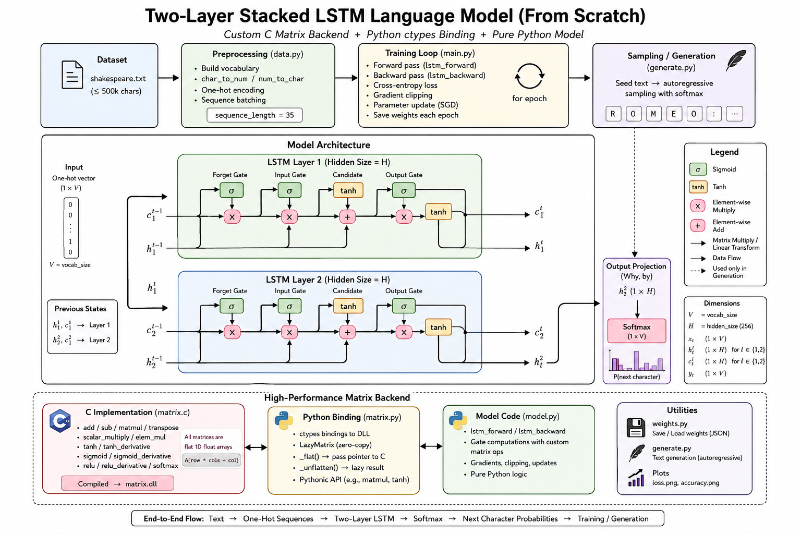
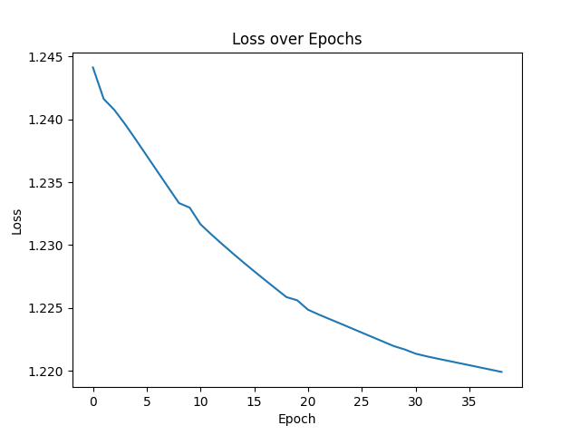
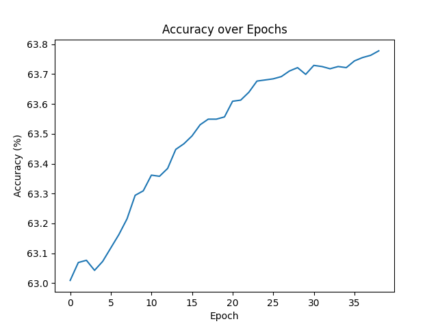

# LSTM Language Model from Scratch
### Shakespeare Text Generator — Built Entirely in Pure Python + Custom C Backend

> A character-level LSTM that learns to write like Shakespeare — trained end-to-end with zero ML frameworks. Every gate computation, every gradient, every matrix operation is implemented by hand. The forward and backward passes are pure Python; the numerical heavy lifting is a custom C shared library called via `ctypes`, making this simultaneously a from-scratch neural network *and* a from-scratch compute engine.

---

## Table of Contents

1. [Project Overview](#project-overview)
2. [Key Features](#key-features)
3. [Mathematical Foundation](#mathematical-foundation)
4. [Network Architecture](#network-architecture)
5. [Hyperparameters](#hyperparameters)
6. [Project Structure](#project-structure)
7. [Installation & Setup](#installation--setup)
8. [How to Run](#how-to-run)
9. [Results & Visualisations](#results--visualisations)
10. [Sample Output](#sample-output)
11. [Limitations & Future Improvements](#limitations--future-improvements)

---

## Project Overview

This project trains a 2-layer LSTM to perform character-level language modelling on Shakespeare's complete works. Given any seed string, the trained model generates new text in the style of Shakespeare, one character at a time.

| Property | Detail |
|---|---|
| **Task** | Character-level text generation |
| **Architecture** | 2-layer LSTM |
| **Dataset** | Shakespeare's complete works (800,000 chars) |
| **Vocab** | All unique characters in the corpus |
| **Loss Function** | Cross-Entropy |
| **Backend** | Custom C matrix library via `ctypes` |

The network is trained purely with Python's `math` and `random` modules for control flow and logic. All matrix operations — multiplication, element-wise products, activation functions, gradient clipping — are dispatched to a hand-written C shared library (`matrix.dll`) through Python's `ctypes` interface, giving near-native performance without NumPy.

---

## Key Features

- **Zero ML dependencies** — no NumPy, no PyTorch, no TensorFlow; every LSTM gate is coded from scratch
- **Custom C compute backend** — `matrix.c` implements matrix multiply, transpose, element-wise ops, all activations, gradient clipping, and more; Python wraps it via `ctypes`
- **Full 2-layer LSTM implemented by hand** — four gates (forget, input, cell, output) computed explicitly at each layer, each timestep
- **Manual BPTT** — every partial derivative through both LSTM layers is written out explicitly via the chain rule; no autograd of any kind
- **Xavier uniform initialisation** — weights drawn from $\left[-\sqrt{\frac{6}{n_\text{in}+n_\text{out}}},\ \sqrt{\frac{6}{n_\text{in}+n_\text{out}}}\right]$; biases initialised to zero
- **Gradient clipping** — all gradients clipped to `[−5, 5]` before weight updates to prevent exploding gradients
- **Learning rate halving** — LR decays by 50% every 10 epochs for stable late-stage convergence
- **Weight persistence** — full model state serialised to JSON after every epoch; training resumes automatically if a checkpoint is found
- **Live training feedback** — loss and accuracy logged every 100 sequences; a Shakespeare sample is generated at the end of every epoch
- **Text generation with seeding** — any seed string (e.g. `"ROMEO: "`) is fed through the network to prime the hidden states before sampling

---

## Mathematical Foundation

All operations are implemented from scratch. The C backend handles numerical computation; Python handles logic and orchestration.

### Character Encoding

Each input character is represented as a one-hot vector of length `vocab_size`:

$$x_t \in \{0,1\}^{V}, \quad \sum_{i=1}^{V} x_{t,i} = 1$$

---

### LSTM Gate Equations

A single LSTM layer computes four gates at each timestep $t$, combining the current input $x_t$ with the previous hidden state $h_{t-1}$:

**Forget gate** — decides how much of the previous cell state to keep:

$$f_t = \sigma(x_t W_f + h_{t-1} U_f + b_f)$$

**Input gate** — decides which new information to write into the cell:

$$i_t = \sigma(x_t W_i + h_{t-1} U_i + b_i)$$

**Cell gate** — produces the candidate values to add to the cell state:

$$\tilde{c}_t = \tanh(x_t W_c + h_{t-1} U_c + b_c)$$

**Output gate** — controls what the hidden state exposes:

$$o_t = \sigma(x_t W_o + h_{t-1} U_o + b_o)$$

**Cell and hidden state updates:**

$$c_t = f_t \odot c_{t-1} + i_t \odot \tilde{c}_t$$

$$h_t = o_t \odot \tanh(c_t)$$

In this 2-layer network, the hidden state $h_t^{(1)}$ of Layer 1 becomes the input to Layer 2 at the same timestep.

---

### Output Layer

The hidden state of Layer 2 is projected to a probability distribution over all characters via a learned weight matrix $W_y$:

$$\text{logits} = h_t^{(2)} W_y + b_y$$

$$\hat{p} = \text{softmax}(\text{logits}) = \frac{e^{\text{logit}_i}}{\displaystyle\sum_{j} e^{\text{logit}_j}}$$

---

### Loss Function

**Cross-Entropy Loss** — the model is penalised by the negative log-probability assigned to the correct next character $y$:

$$\mathcal{L} = -\log\bigl(\hat{p}_{y}\bigr)$$

---

### Backpropagation Through Time (BPTT)

Gradients are propagated back through the sequence and both LSTM layers using the chain rule. All partial derivatives are written explicitly in `model.py`.

**Output layer gradient** (combined softmax + cross-entropy):

$$\delta_\text{out} = \hat{p} - \mathbf{1}[y]$$

**Gate gradients — Layer 2** (representative; all four gates follow the same pattern):

$$\delta_{o}^{(2)} = \delta_{h}^{(2)} \odot \tanh(c^{(2)}) \cdot \sigma'(o^{(2)})$$

$$\delta_{c}^{(2)} = \delta_{h}^{(2)} \odot o^{(2)} \odot \tanh'(c^{(2)})$$

**Gradient flow from Layer 2 to Layer 1:**

$$\delta_{h}^{(1)} = \delta_{f}^{(2)} W_f^{(2)\top} + \delta_{i}^{(2)} W_i^{(2)\top} + \delta_{\tilde{c}}^{(2)} W_c^{(2)\top} + \delta_{o}^{(2)} W_o^{(2)\top}$$

**Gradient clipping** (applied to all weight gradients before the update):

$$\hat{g} = \text{clip}(g,\ -5,\ 5)$$

**Weight update — Stochastic Gradient Descent:**

$$\theta \leftarrow \theta - \alpha \cdot \hat{g}$$

**Learning rate schedule:**

$$\alpha_{\text{epoch}} = \alpha_0 \times 0.5^{\lfloor \text{epoch} / 10 \rfloor}$$

---

## Network Architecture

```
Input                 LSTM Layer 1            LSTM Layer 2           Output
(one-hot char)        hidden_size=256         hidden_size=256        (vocab_size)

                      ┌─────────────┐         ┌─────────────┐
x_t ──────────────►  │  f₁ i₁ c̃₁ o₁ │──h₁──►  │  f₂ i₂ c̃₂ o₂ │──h₂──► W_y ──► softmax ──► p̂
  [1 × vocab_size]    │  cell: c₁   │         │  cell: c₂   │         [vocab_size]
                      └─────────────┘         └─────────────┘
                             ▲                        ▲
                        h₁(t-1), c₁(t-1)        h₂(t-1), c₂(t-1)

Sequence length : 30 characters
Training signal : predict character at position t+30
Generation      : seed → prime hidden states → sample char-by-char
```

### Architecture Diagram



---

## Hyperparameters

| Hyperparameter | Value |
|---|---|
| Hidden Size | `256` per layer |
| Number of Layers | `2` |
| Sequence Length | `30` |
| Learning Rate (α₀) | `0.01` |
| LR Schedule | Halved every `10` epochs |
| Epochs | `100` |
| Dataset Limit | `800,000` characters |
| Weight Initialisation | Xavier Uniform |
| Bias Initialisation | `0` |
| Gradient Clip Range | `[−5.0, 5.0]` |
| Update Strategy | Stochastic GD (one sequence per step) |
| Loss Function | Cross-Entropy |

---

## Project Structure

```
Long Short Term Memory/
│
├── LSTM-Model/
│   ├── main.py                 ← Training loop, epoch management, weight save/load, plot generation
│   ├── model.py                ← LSTM forward pass, backward pass, weight initialisation, loss function
│   ├── data.py                 ← Shakespeare loader, character mappings, one-hot encoder, sequence builder
│   ├── generate.py             ← Text generation: seed priming + character-by-character sampling
│   ├── weights.py              ← JSON serialisation and deserialisation of full model state
│   ├── config.py               ← All hyperparameters and file paths in one place
│   └── shakespeare.txt         ← Full Shakespeare corpus (~1.1 MB)
│
├── Backend/
│   ├── matrix.c                ← C implementation of all matrix and activation operations
│   ├── matrix.dll              ← Compiled shared library (Windows); loaded via ctypes at runtime
│   └── matrix.py               ← Python ctypes wrapper — maps every C function to a Python-callable
│
├── weights/
│   └── weights_2layer.json     ← Full serialised model checkpoint (weights + epoch + LR)
│
├── Images/
│   ├── Architecture.png        ← Network architecture diagram
│   ├── loss.png                ← Cross-entropy loss curve over training
│   └── accuracy.png            ← Character-prediction accuracy curve over training
│
└── README.md
```

---

## Installation & Setup

Ensure Python 3.x is installed. Install the two lightweight dependencies used only for plotting and data display:

```bash
pip install matplotlib
```

> **No other packages are required.** The neural network, all matrix operations, all activations, and all gradient computations run on Python's built-in `math` and `random` modules plus the bundled C library.

**Platform note:** The compiled backend (`matrix.dll`) targets Windows. On Linux or macOS, recompile `matrix.c` as a shared object:

```bash
# Linux
gcc -O2 -shared -fPIC -o Backend/matrix.so Backend/matrix.c

# macOS
gcc -O2 -dynamiclib -o Backend/matrix.dylib Backend/matrix.c
```

Then update the library path in `Backend/matrix.py` to point to the new `.so` / `.dylib` file.

---

## How to Run

Navigate into the `LSTM-Model/` directory and run the training script:

```bash
cd LSTM-Model
python main.py
```

**What happens at runtime:**

1. **Data loading** — `shakespeare.txt` is read and trimmed to 800,000 characters; a character vocabulary is built and all sequences of length 30 are prepared as input–target pairs
2. **Initialisation** — if `weights/weights_2layer.json` exists, the full model state is loaded and training resumes from the saved epoch; otherwise weights are Xavier-initialised and biases zeroed
3. **Training loop** — for each epoch, every sequence is processed one at a time: a forward pass runs through all 30 timesteps, then a backward pass on the final timestep updates all weights; loss and accuracy are logged every 100 sequences and every 1,000 steps
4. **End-of-epoch** — full weights are saved to JSON; a 100-character sample seeded with `"ROMEO: "` is printed to console
5. **Completion** — loss and accuracy plots are saved to `Images/`; five Shakespearean samples are generated from classic seeds

**To generate text from a saved checkpoint without retraining:**

```bash
# Run generate.py directly after loading weights in a short script,
# or interrupt main.py immediately — it loads saved weights before training begins.
```

---

## Results & Visualisations

### Final Epoch Metrics (Epoch 99)

| Metric | Value |
|---|---|
| Per-character Cross-Entropy Loss | `1.2199` |
| Character-Prediction Accuracy | `63.78%` |
| Epoch Training Time | `~8 min 15 sec` |
| Sequences Processed | `~26,600` |

### Training Curves

**Loss over Epochs** — cross-entropy measured per character across the full training corpus, showing steady minimisation as the LSTM learns sequence structure.



**Accuracy over Epochs** — character-prediction accuracy across all training sequences, tracking how reliably the model predicts the correct next character.



---

## Sample Output

After 100 epochs of training, the model generates text by priming hidden states with a seed string and sampling character-by-character. The outputs below are real samples from the final epoch:

```
--- Seed: 'ROMEO: ' ---
ROMEO: that sold deaght, whreateratif hick be a to.
?
The vath whith astign whink thensepparted thy wat.
R

--- Seed: 'JULIET: ' ---
JULIET: hay a loud trie thor swild wither
And indodnedill:
What stands on prom brown his alm
Cith my all-w-'

--- Seed: 'HAMLET: ' ---
HAMLET: apwartes wer for with dach ky jones!
And ail is be.
ETIN OWICHER
S:
I lave,
Ko drount no my lieven

--- Seed: 'OTHELLO: ' ---
OTHELLO: rit arres callow.
ORETINENTY less okn in Morsen, a oll ofw rive-.
ARWISSUK:
Cay, lond bod slawerer

--- Seed: 'MACBETH: ' ---
MACBETH: OwAY:
Co prrotiorr hemosentiless brail, the woll.
Thin, my gille in blrobders and the reaturl of you
```

The model has clearly learned word-length patterns, line breaks, speaker-label formatting (`NAME:`), and some common English letter clusters — the hallmarks of a character-level model that has absorbed surface structure without yet reaching semantic coherence. Further training epochs or an adaptive optimiser (see Limitations) would push it toward more legible output.

---

## Limitations & Future Improvements

| Limitation | Improvement |
|---|---|
| Vanilla SGD only — no adaptive optimiser | Implement Adam (per-parameter adaptive LR with momentum) for faster, more stable convergence |
| One sequence per weight update | Add mini-batch gradient accumulation to reduce update noise |
| Hardcoded 2-layer depth and 256 hidden units | Make `num_layers` and `hidden_size` fully configurable at runtime |
| `matrix.dll` targets Windows only | Cross-compile `matrix.c` to `.so` / `.dylib` and auto-detect platform in `matrix.py` |
| No temperature control during generation | Expose a temperature parameter to sharpen or soften the sampling distribution |
| JSON checkpoint is ~18 MB and slow to serialise | Replace JSON with binary serialisation (e.g. `struct.pack`) for faster save/load |
| BPTT is single-step only — no truncated BPTT across sequences | Implement truncated BPTT across a window of sequences for richer temporal dependencies |
| No validation split — loss is training loss only | Hold out a validation set and track validation perplexity to detect overfitting |

---

## Tech Stack

```
Language    : Python 3.x
Compute     : Custom C shared library (matrix.c / matrix.dll) via ctypes
Network     : math, random  (standard library — no external computation)
Dataset     : Shakespeare's complete works (bundled as shakespeare.txt)
Plots       : matplotlib  (loss and accuracy curves only)
Persistence : json  (full model checkpoint serialisation)
```